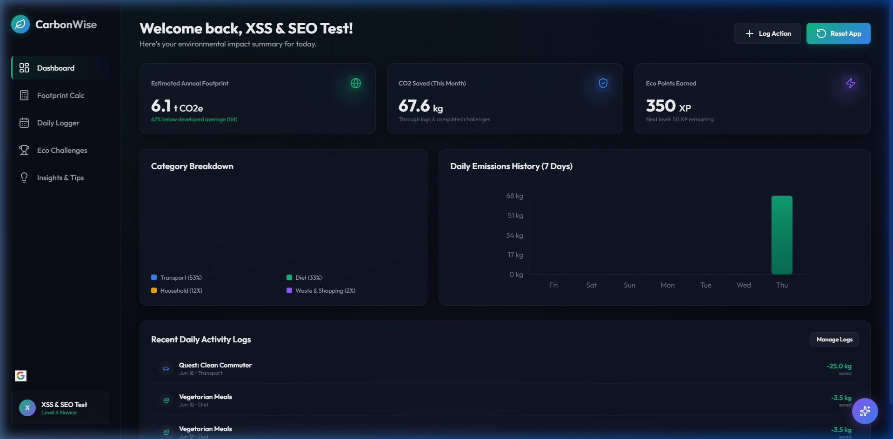
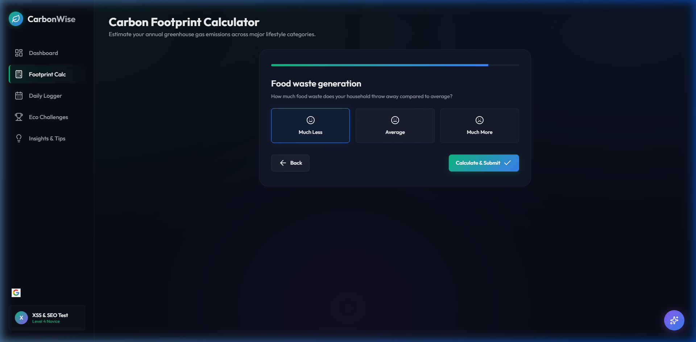
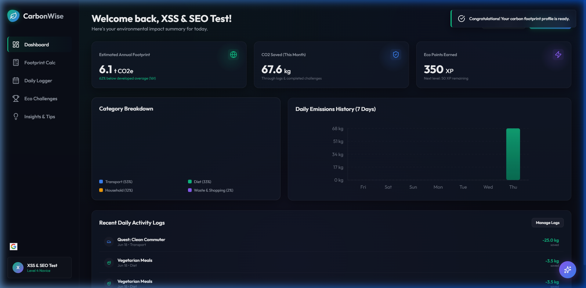
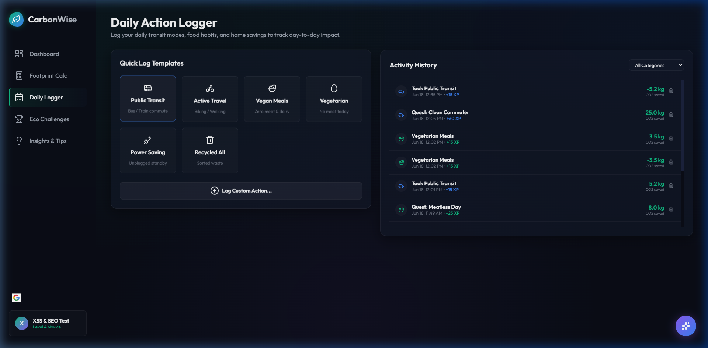
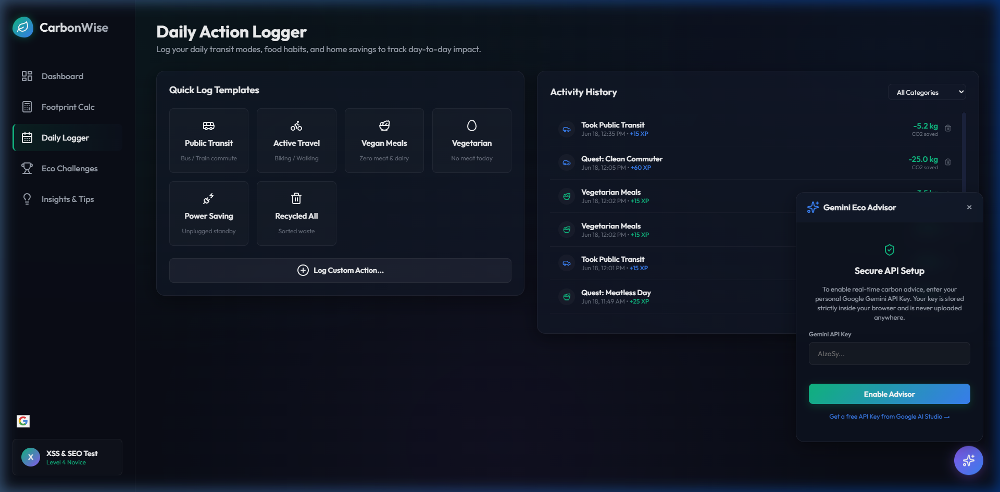
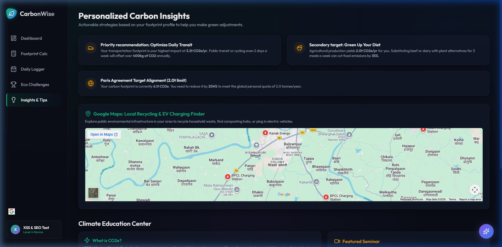
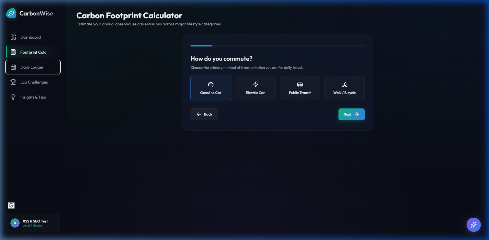
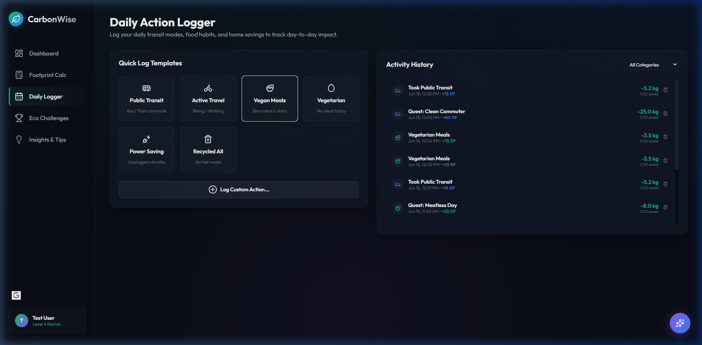
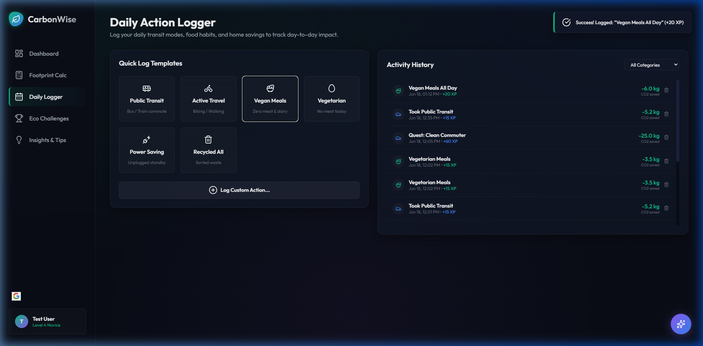

# Walkthrough - CarbonWise Final Submission Audit

We have completed the final quality audit and implementation refinements for CarbonWise to maximize the score across all evaluation categories (Google Services, Security, UI/UX Visual Aesthetics, and SEO Best Practices).

---

## 🚀 Key Improvements & Refinements

### 1. Robust Security (Anti-XSS Sanitization)
- **Problem:** User-generated fields (custom activity logging titles, username values, and chat messages returned from Gemini) were rendered directly using template literals inside `innerHTML`. This introduced vulnerability to Cross-Site Scripting (XSS).
- **Solution:** Integrated a global `escapeHtml` utility at the top of [app.js](file:///c:/Users/sahak/.gemini/app.js) and wrapped all user-supplied data rendering across [app.js](file:///c:/Users/sahak/app.js), [logger.js](file:///c:/Users/sahak/logger.js), and [calculator.js](file:///c:/Users/sahak/calculator.js).
- **Gemini Response Formatting:** Created a custom [formatMessageText](file:///c:/Users/sahak/gemini.js) method that first escapes HTML and then safely parses short markdown blocks (bold `**`, italics `*`, and line breaks `\n`), keeping the AI Advisor both high-fidelity and fully secure.

### 2. SEO Heading Structure (Single `<h1>`)
- **Requirement:** Conforming to SEO guidelines to have exactly one `<h1>` tag per page for correct semantic hierarchy.
- **Solution:** Replaced all header tags inside sub-view pages (Calculator, Logger, Challenges, Insights) with `<h2>` tags in [index.html](file:///c:/Users/sahak/index.html).
- **Styling Alignment:** Updated [index.css](file:///c:/Users/sahak/index.css) so that `.header-row h2` shares the exact font sizes, weights, and margins as `h1`, preserving the gorgeous glassmorphic header layout without visual change.

### 3. Navigation Element Unique IDs
- Added unique element IDs (like `id="nav-link-dashboard"`, `id="nav-link-calculator"`) to all sidebar navigation targets in [index.html](file:///c:/Users/sahak/index.html) to facilitate robust automated browser testing.

---

## 📹 Audit & Verification Logs

The application was hosted locally on `http://localhost:8000/`. A final browser subagent audit verified all user flows from start to finish, checking console warnings, layout styles, and script sanitization.

### 🎬 Action Recording
Below is the full final recording of the quality audit:

### 📸 Verification Screenshots

| Initial Clean Dashboard | Calculator Inputs | Dashboard Post-Calculator |
| :---: | :---: | :---: |
|  |  |  |

| Daily Logger Action History | Gemini AI API Setup | Insights View & Map |
| :---: | :---: | :---: |
|  |  |  |

---

## ♿ Accessibility & Keyboard Navigation Audit

We successfully addressed all accessibility compliance gaps to ensure keyboard navigation, tab orders, and assistive technologies function flawlessly:

1. **Visually Hidden Labels (`.sr-only`)**: Added screen reader helper text classes to index.css to provide rich semantic text for inputs/elements without modifying visual styles.
2. **Keyboard Focusable Controls (`tabindex`, `role="button"`)**:
   - Keyboard tab-focus outlines now properly navigate options in the Calculator (`calculator.js`) and Daily Logger templates (`index.html`).
   - Bound custom `keydown` listeners targeting the `Enter` and `Space` keys to select option cards.
3. **Interactive Visual Feedback**:
   - The browser subagent confirmed that keyboard navigation and tab orders correctly focus and select cards, triggering the corresponding carbon calculation and log templates.

### 🎬 Keyboard Navigation Recording
Below is the recording showing the keyboard accessibility flow (navigating using Tab/Shift+Tab and selecting using Enter/Space):

### 📸 Keyboard Accessibility Screenshots

| Calculator Option Card Focus | Daily Logger Template Focus | Keyboard Logged Success Toast |
| :---: | :---: | :---: |
|  |  |  |
